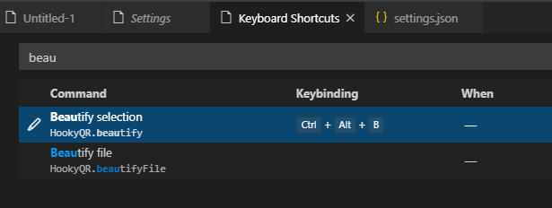
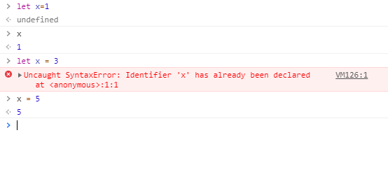
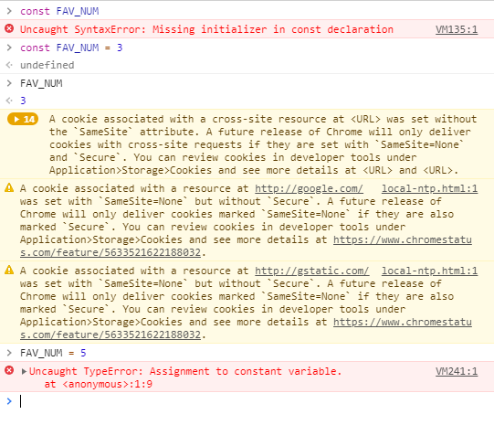
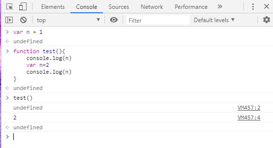

##  Javascript


### 1. 설정

- [node.js](https://nodejs.org/ko/) , 안정적 신뢰도 높음으로 다운로드

- 설치해준다

- 설치완료 확인은 `node -v`

- ```cmd
  student@M1504 MINGW64 ~/Documents/GitHub/STUDY/Python/Javascript (master)
  $ node -v
  v12.13.1
  #확인 가능!
  ```

- extension 설치!

  - 가로를 자동으로 닫아주는 auto close tag 설치
  - 매칭되는 가로를 이쁘게~ rainbow brackets 설치
  - indent부분을 칼라풀 하게 ~ indent rainbow 설치
  - 코드 정렬을 이쁘게 ~ beautify설치
  - 단축키만 입력하면 실행! code runner 설치
  - eslint 설치

- 설정을 해야한다.

  - vscode에서 file>preference>settings 에서 json 검색

  - edit in settings.json 클릭!

  - ```json
    {
        "terminal.integrated.shell.windows": "C:\\Program Files\\Git\\bin\\bash.exe",
        "window.zoomLevel": 0,
        "editor.snippetSuggestions": "top",
        "editor.tabCompletion": "on",
        "workbench.iconTheme": "vscode-icons",
        "[html]": {
        "editor.tabSize": 2
        },
        "[css]": {
        "editor.tabSize": 2
        },
        "[python]": { // 추가!
        "editor.tabSize": 4,
        },
        "terminal.integrated.fontSize": 16,
        "editor.tabSize": 2,
        
        
        
        "beautify.language": {
        "js": {
        "type": ["javascript", "json"],
        "filename": [".jshintrc", ".jsbeautifyrc"]
        // "ext": ["js", "json"]
        // ^^ to set extensions to be beautified using the javascript beautifier
        },
        "css": ["css", "scss"],
        "html": ["htm", "html", "django-html"]
        // ^^ providing just an array sets the VS Code file type
        },
        
        
        "files.insertFinalNewline": true, //새줄이 자동으로 만들어진채로 종료!
            
        "terminal.integrated.cwd": "${workspaceFolder}",
    }
    
    ```

  - 나의 경우 (ctrl + alt  + n 하면 돌아가지 않는데 `"code-runner.runInTerminal": true`추가하니 output이 아닌 바로 터미널로 접근을 한다!)

  - 확인하고 저장하자.

  - settings 에서 editor: insert space 로 검색

  - 

  - tab시  space가 들어가는지 설정 빈박스로!

  - settings에서 detext indentation 로 검색

  - 

  - 박스 체크 표시!

- file>preference > keyboard shortcuts

- 

- 단축키 설정하자

- 

- 없는 단축키로 설정을 해주자.(편한걸로 하면 된다.)


### 2. Naming Convention

#### 2.1 lowerCamelCase

- 일반적인 Camel case

#### 2.2 UpperCamelCase

- 모든 단어의 첫번째 글자는 대문자로

#### 2.3 snake_case

- _ 를 포함하는 것!

#### 2.4 Hungarian notation

- 변수의 이름앞에 해당 변수의 타입을 표기하는 것
- u16number  / unsigned16bit로 저장되는 것이다.
- s32num / signed32bit로 저장되는 것

#### 2.5 kebab-case

- -하이픈을 사용하여 표시!


### 3. JS 변수

#### 3.1 let

- 변수 타입
- 값을 재 할당할 수 있는  선언 하는 키워드
- 선언은 1번만 가능
- 재할당은 계속 가능!
- 변수의 범위는 blockscope
- 브라우저 f12를 누르고 console에서 작업
- 
- 두번 변수 설정 하니 에러가 뜬다.
- 하지만 재 할당은 에러 없다

#### 3.2 const

- 값이 변하지 않는 상수 선언 키워드
- 선언도 한번만 가능!
- 재할당 불가능!
- block scope 범위를 가진다.
- 
- 선언과 동시에 값을 설정해 주어야 에러가 안뜬다!
- 재설정 안됨을 확인 할 수 있다.

#### 3.3 var

- ES6 이전에 문제가 많이 발생했었다. 외부 변수로 갈 수도 있고 hoisting문제도 있다.

- > #### hoisting
  >
  > 
  >
  > - 하나는 undefined와 2값이 나오게 된다.  
  >
  > - 느낌상 첫번쨰 console.log에서는 1 두번째는 2가 나올 것 같은데 hoisting때문에 n이 먼저 설정이 되고 
  >
  > - ```javascript
  >   function test(){
  >       var n;
  >       console.log(n)
  >       n = 2
  >       console.log(n)
  >   }
  >   ```
  >
  > - 로 인식되어 저런 문제가 생긴다. 이런 문제로 잘 안쓰인다.

  #### 3.4 정리

  - let : 할당은 자유, 선언 1 번 , block
  - const : 할당은 1번, 선언 1 번, block
  - var : 할당 선언 자유지만. 사용하지 않는다.

### 4. 조건문

#### 4.1 if else if

- ```cmd
  const userName = prompt("니 이름이 뭐니?")
  let message = ""
  
  if (userName === "pengsu"){
  	message = "우주 대스타";
  }else if (userName === "그렇구나"){
  	message = "끄덕끄덕";
  }else{
  	message = "<h1>어서오세요. ${userName}</h1>"
  }
  
  message;
  document.write(message)
  
  ```

### 5. loop문(while, for)

#### 5.1 while

- ```js
  let i = 0;
  
  while (i < 10) {
  	console.log(i)
  	i++;
  }
  #ctrl + alt + n 하면 실행한다.
  ```

#### 5.2 for

- ```js
  let i = 0;
  
  // while (i < 10) {
  // 	console.log(i)
  // 	i++;
  // }
  
  // for (let j = 10; j > 0; j--) {
  // 	console.log(j)
  // }
  
  const numbers = [1,2,3,4,5,6,7]
  
  for( let num of numbers){
  	console.log();
  }
  
  
  let sampleObj = {
  	a: 1,
  	b: "hello",
  	c: [3,4]
  }
  
  for ( let obj in sampleObj){
  	console.log(obj);
  	console.log.(sampleObj[obj])
  }
  
  ```

### 6. 선언문

#### 6.1 선언식

- ```js
  //선언식
  
  function add(num1 , num2){
  	return num1 + num2
  }
  //미리 선언해 두고 필요할때 사용
  
  let sum = add(5,7)
  
  
  ```

- 선언식은 미리 load가 된다.

#### 6.2 표현식

- ```js
  // 표현식
  const sub = function(num1, num2){
  	return num1 - num2
  }
  
  let val = sub(12, 5)
  console.log(val)
  console.log(typeof sub)
  console.log(typeof add)
  
  ```

### 7. 화살표 함수

#### 7.1 화살표 함수( =  익명함수)

- 익명 함수

- function 표현에 비해 구문이 짧다

- 생성자로 사용할 수가 없다.

- 사용법

  - function을 생략 해도 된다.
  - 인자가 1개인 경우 괄호도 생략 가능
  - body에 표현이 한줄인 경우 return 이랑 {} 생략 가능

- ```js
  const greeting = function(name){
  	return 'hello ${name}'
  }
  
  //1. function 키워드 생략
  const greeting  = (name) => {
  	return 'hello'
  }
  
  //2. 인자가 1개인 경우 괄호도 생략 가능
  
  const greeting = name =>{
  	return 'hello ${name}'
  }
  
  //3. body(괄호 안의 부분 ) 의 표현식이 1줄인 경우 
  const greeting = name => 'hello ${name}'
  
  ```

- 연습~

- ```js
  // const greeting = function(name){
  // 	return 'hello ${name}'
  // }
  
  // //1. function 키워드 생략
  // const greeting  = (name) => {
  // 	return 'hello'
  // }
  
  // //2. 인자가 1개인 경우 괄호도 생략 가능
  
  // const greeting = name =>{
  // 	return 'hello ${name}'
  // }
  
  // //3. body(괄호 안의 부분 ) 의 표현식이 1줄인 경우 
  // const greeting = name => 'hello ${name}'
  
  // // 실습
  // let square = function(num){
  // 	return num **2
  // }
  
  // let square = (num)=>{
  // 	return num **2
  // }
  
  // const square = num => 'return num ** 2'
  
  
  // let noArags = () => 'no Args'
  // let noArgs = _=>'no Args'
  
  // //object 형식으로 반환 된다면? 가로로 해주면 된다!
  
  // let returnObj = () =>{
  // 	return {key:'value'}
  // }
  let returnObj = () => ({key:'value'})
  console.log(returnObj())
  
  //인자에 기본값을 설정했을 경우
  
  let sayHi = function(name="pengsu"){
  	return 'hi ${name}'
  }
  
  let sayHi = (name="pengsu") => 'hi ${name}'
  console.log(sayHi('bbung'))
  
  
  //즉시 실행 함수
  //즉시 실행 함수 는 왜 쓰나? 초기화 할 때! 
  
  const cube = function(num){
  	return num ** 3
  }//(2)
  
  //익명함수랑 같은데 왜 다른가!? 뒤에 (2) 바로 값을 넣어 줄수 있다.
  
  console.log(cube(2))
  
  //익명함수 즉시 실행 
  
  console.log(function(num){return num ** 3}(2))
  console.log(num => num ** 3(4))
  
  
  
  
  
  ```

### 8.배열

#### 8.1 push, pop , unshift , shift

- ```js
  const numbers = [1, 2, 3, 4, 5, 6, 7]
  console.log(numbers[1])
  console.log(numbers[-1]) //파이썬은 되지만 여기서는 안된다! 양의 정수만 가능!
  console.log(numbers.length)
  
  console.log(numbers.reverse()) //뒤집힌다!
  console.log(numbers) //한번 reverse 면 원본이 뒤집힌다! 주의**
  console.log(numbers[0]) //가장 마지막 번호를 뽑아올 수 있다.  
  
  
  //push 배열의 마지막에 값을 넣어 주는 것 넣어주고 끝나면 배열의 총 길이를 return 해준다.
  numbers.push('peng') ///return 값은 배열의 길이가 된다. (새롭게 추가된 값까지의 길이를 알려준다.)
  console.log(numbers)//맨 마지막에 추가됨을 확인 할 수 있다.
  console.log(number.push('su'))
  
  //pop 빼는 아이
  
  console.log(numbers.pop()) //할때마다 값이 날아갈 것이다! 조심!
  console.log(numbers) //배열에서도 지워버리는 역할
  
  //unshift 배열의 가장 앞쪽에 요소를 추가
  console.log(numbers.unshift("pengsu"))
  console.log(numbers)
  
  //shift
  console.log(numbers.shift())
  console.log(numbers)
  
  
  ```

#### 8.2 include , join

- ```js
  
  //includes
  console.log(numbers.includes(1)) //ture false로 나오므로 있는지 없는지 확인 가능
  
  console.log(numbers.indexOf(2)) //위치를 알려준다! 어느 위치에 있는지
  
  numbers.push('peng' , 'peng') //값 중복이면 어찌 될까?
  console.log(numbers)
  console.log(numbers.indexOf('peng')) //첫번쨰 오는 인덱스의 값만 반환을 해준다. 중복해도 처음 것만!
  
  //join
  console.log(numbers.join('-')) //1-2-3-4-5-6-7-peng-peng 
  console.log(numbers.join()) //1,2,3,4,5,6,7,peng,peng 기본은 , 이다.
  console.log(numbers.join('')) //1234567pengpeng 다 붙여서!
  console.log(numbers) //(9) [1, 2, 3, 4, 5, 6, 7, "peng", "peng"] 원본은 건드리지 않는다!
  
  
  
  ```

### 9. objects

- ```js
  const pengsu = { //키와 value를 갖는다.
  	name : '펭수' ,
  	"phone number" : '012345678',
  	profile:{
  		deram : '우주대스타',
  		age : '10살',
  		sqpeciality : "요들송",
  	}
  
  }
  console.log(pengsu.name)
  console.log(pengsu['name'])
  console.log(pengsu['phone number'])
  
  console.log(pengsu.profile)
  console.log(pengsu.profile.dream)
  
  
  //before 
  
  var books = ['Learning JS', 'Learning Django']
  var comics = {
  	DC : ['AquaMan' , 'superMan'],
  	marvle : ['IronMan' , 'andMan']
  
  }
  
  var magazins  = null;
  
  var bookShop = {
  	books : books,
  	comics : comics,
  	magazines : magazines,
  }
  console.log(bookShop)
  console.log(typeof bookShop)
  console.log(bookShop.boos[0])
  
  
  //after
  let bookShop = {
  	books,
  	comics,
  	magazines,
  
  }
  console.log(bookShop)
  console.log(typeof bookShop)
  console.log(bookShop.boos[0])
  
  
  
  ```


### 10. json

#### 10.1 키 - 값 형식

- 차이점?

- json이 문자열이기 떄문에 object로 변환하는 중간 과정을 거쳐야 object처리 가능

- json -> object `parse`

- ```js
  const pengsu = { //키와 value를 갖는다.
  	name : '펭수' ,
	"phone number" : '012345678',
  	profile:{
  		deram : '우주대스타',
  		age : '10살',
  		sqpeciality : "요들송",
  	}
  
  }
  console.log(pengsu.name)
  console.log(pengsu['name'])
  console.log(pengsu['phone number'])
  
  console.log(pengsu.profile)
  console.log(pengsu.profile.dream)
  
  
  //before 
  
  var books = ['Learning JS', 'Learning Django']
  var comics = {
  	DC : ['AquaMan' , 'superMan'],
  	marvle : ['IronMan' , 'andMan']
  
  }
  
  var magazins  = null;
  
  var bookShop = {
  	books : books,
  	comics : comics,
  	magazines : magazines,
  }
  console.log(bookShop)
  console.log(typeof bookShop)
  console.log(bookShop.boos[0])
  
  
  //after
  let bookShop = {
  	books,
  	comics,
  	magazines,
  
  }
  console.log(bookShop)
  console.log(typeof bookShop)
  console.log(bookShop.boos[0])
  
  
  
  ```
  


### 11. Array Helper Method

#### 11.1 Array Helper Method

- 일종의 라이브러리다. 자주 사용하는 로직을 재활용 하기 쉽게
- forEach, filter, find, map, every, some, reduce

#### 11.2 forEach

- `array.forEach(callback(element,index,array))`

- ```js
  //예전 방식
  console.log("예전 방식")
  
  var colors = ['red' , 'orange' , 'yellow']
  for (var i = 0; i < colors.length; i++){
  	console.log(colors[i])
  }
  console.log("forEach 방식")
  // use forEach
  const COLORS = ['red' ,'orange' , 'yellow']
  COLORS.forEach(function(color){
  	console.log(color)
  })
  
  
  //즉시실행함수로 
  console.log("즉시실행함수로 ")
  const result = COLORS.forEach(color=> console.log(color))
  //foreach는 아무것도 리턴을 하지 않는다. 
  console.log(result)  //그래서 결과는 undefined가 뜨게 된다.
  
  
  
  
  ```

##### 11.2.1. 실습해보자.

- ```js
  //---------------------------------------------------
  //실습 넘버1 
  console.log("실습넘버1")
  function hadlePosts(){
  	const posts = [{
  		id: 23,
  		title: "오늘의 뉴스",
  
  	},
  	{
  		id: 34,
  		title: "오늘의 스포츠",
  	},
  	{
  		id : 78,
  		title : "오늘의 먹거리"
  	}
  
  	]
  // 실습 2
  //image 배열 안에 있는 정보를 가지고 넓이를 구하고 그 값을 areas에 저장
  
  const IMAGES = [
  	{height: 10 , width: 30},
  	{height: 22 , width: 37},
  	{height: 54 , width: 42},
  ]
  let areas = []
  ```

- ```js
  //---------------------------------------------------
  //실습 넘버1 
  console.log("실습넘버1")
  function hadlePosts(){
  	const posts = [{
  		id: 23,
  		title: "오늘의 뉴스",
  
  	},
  	{
  		id: 34,
  		title: "오늘의 스포츠",
  	},
  	{
  		id : 78,
  		title : "오늘의 먹거리"
  	}
  
  	]
  
  	console.log("예전방식")
  	for (let i = 0; i < posts.length ; i++){
  		console.log(posts[i])
  	}
  	console.log("forEach방식")
  	posts.forEach(post => console.log(post))
  
  }
  //3개의 objects를 가지는 리스트 완성! 
  hadlePosts()
  
  
  // 실습 2
  //image 배열 안에 있는 정보를 가지고 넓이를 구하고 그 값을 areas에 저장
  
  const IMAGES = [
  	{height: 10 , width: 30},
  	{height: 22 , width: 37},
  	{height: 54 , width: 42},
  ]
  let areas = []
  
  function test2(){
  	const IMAGES = [
  		{height: 10 , width: 30},
  		{height: 22 , width: 37},
  		{height: 54 , width: 42},
  	]
  	let areas = []
  	
  	IMAGES.forEach(i => areas.push(i.height * i.width))
  	console.log(areas)
  }
  test2()
  
  ```

  

#### 11.3 map

- `arry.map(callback(element,index))`

- 배열 내에 모든 값을 변환 시킬 때 사용하게 된다.

- ```js
  //배열에 모든 요소에 2를 곱하여 새로우 배열로 만들기
  //before
  console.log("★ before")
  var numbers = [1, 2, 3]
  var doubleNumber = []
  
  for (var i = 0; i < numbers.length ; i++){
  	doubleNumber.push(numbers[i]*2)
  }
  console.log("원값 : ",numbers)
  console.log("계산값 : " , doubleNumber)
  // map 을 사용해 보자
  
  console.log("★ map사용")
  let NUMBERS = [2 , 4 , 6] //let으로 해서 원본을 바꾸는지 새롭게 배열을 만드는지 확인해보자~
  let  doubleNum = NUMBERS.map(function (num){
  	return num * 2
  }) //map 알아서 배열로 만들어 주기 떄문에  push를 사용해 줄 필요가 없다!
  
  let doubleNum2 = numbers.map(num => num * 2)
  
  console.log("원본값:" ,NUMBERS)
  console.log("새로운 값일까?: ",doubleNum)
  console.log("map : ", doubleNum2)
  
  
  ```

##### 11.3.1 . 실습해보자.

- ```js
  // 실습 1
  // 숫자가 담긴 배열을 받아서
  // 각 숫자들의 제곱근이 들어있는 새 배열로 만들기
  const newNum = [4, 9, 16]
  
  // 실습 2 
  // images 배열 안에 Objects 들의 height만 저장되어있는 배열을 만들자.
  const IMAGES = [
  	{height : '34px' , width: '39px'},
  	{height : '44px' , width: '79px'},
  	{height : '87px' , width: '19px'}
  ]
  
  
  //실습 3
  //{name : brand , movie : 영화}
  //object로 합쳐주자~예상 결과값은
  //[{name:Marvel , movie:Avergers} , {name:DC, movie:Batman}]
  
  const brands = ["Marvel" , "DC"]
  const movies = ["Avengers" , "Batman"]
  ```

- ```js
  // 실습 1
  // 숫자가 담긴 배열을 받아서
  // 각 숫자들의 제곱근이 들어있는 새 배열로 만들기
  
  console.log('★ 실습1')
  const newNum = [4, 9, 16]
  let roots = newNum.map(num => num ** 0.5)
  console.log(roots)
  
  // 실습 2 
  // images 배열 안에 Objects 들의 height만 저장되어있는 배열을 만들자.
  console.log('★ 실습2')
  const IMAGES = [
  	{height : '34px' , width: '39px'},
  	{height : '44px' , width: '79px'},
  	{height : '87px' , width: '19px'}
  ]
  
  let ww = IMAGES.map(w => w.height)
  
  console.log(ww)
  
  //실습 3
  //{name : brand , movie : 영화}
  console.log('★ 실습3')
  const brands = ["Marvel" , "DC"]
  const movies = ["Avengers" , "Batman"]
  
  const Heroes = brands.map(function (brand, idx){
  	return {name : brand , movie : movies[idx]} //인덱스로 선택을 해주면 OK
  })
  const Heroes2 = brands.map((brand,idx) => ({name:brand , movie:movies[idx]})) 
  //인자가 두개이기 떄문에 () 생각 불가능이므로 (brand, idx) , 해 주고 {}가 있으므로 ({}) 해주어야한다.
  console.log(Heroes)
  console.log(Heroes2)
  
  
  
  ```


#### 11.4. filter

- `array.fliter(callback(element,..))`

- 새로운 배열로 리턴을 해준다. 원하는 요소를 필터링 할 수 있다.

- ```js
  const products = [
  	{ name : 'cucumber' , type : 'vegetable'},
  	{ name : 'banana' , type : 'fruit'},
  	{ name : 'carrot' , type : 'vegetable'},
  	{ name : 'apple' , type : 'fruit'},
  ]
  
  //type이 과일이 친구만 뽑기 위해서는?
  
  //befor
  console.log("★  befor")
  var selectProducts = []
  for (var i = 0 ; i < products.length; i++){
  	if(products[i].type === "vegetable"){
  		selectProducts.push(products[i])
  	}
  }
  
  console.log(selectProducts)
  
  
  //filter 로
  console.log("★  filter")
  
  let selectProducts2 = products.filter(function(prod){
  	return prod.type === "vegetable"
  
  })
  console.log("filter : ",selectProducts2)
  console.log("원본 : " , products)
  
  
  
  ```

##### 11.4.1 실습

- ```js
  //실습 1
  //80점 이상인 결과만 따로 배열로 만들기
  ```

- ```js
  //실습 1
  //80점 이상인 결과만 따로 배열로 만들기
  const testResults = [90, 85, 70, 78, 100, 86, 99, 82]
  let test1 = testResults.filter(score => (score>=80))
  console.log(test1)
  console.log(testResults)
  //원본 데이터를 건드리지 않음을 확인 할 수 있다.
  ```


#### 11.5 . reduce

- 배열내의 시험 같은 점수가 있고, 평균을 내고 싶을 때 이용하게 된다.

- `array.reduce(callback(acc , element, idx ))` 첫번째는 누적된 값, element, idx순서이다.

- 배열의 길이만큼 나눠주면 평균을 구하기 쉽다!

- ```js
  //배열의 총합을 구하기
  const numbers = [1, 2, 3, 4]
  
  // before
  console.log("★  before")
  let total = 0;
  for (let i = 0 ; i< numbers.length ; i++){
  	total += numbers[i]
  }
  console.log(total)
  
  //reduce
  console.log("★  reduce")
  let sum = numbers.reduce(function(total, num){ //total로 이전값을 분류 (total=이전값이 된다.)
  	return total += num //이전값에 현재값을 계속 더해주면!!! 총합이 된다.
  }, 0) //마지막에는 
  console.log("총합 : ",sum)
  console.log("이전값  :  " , numbers)
  
  ```

  

##### 11.5.1 실습

- ```js
  //실습 1
  //평균 구하기
  
  const testResults = [90, 85, 70, 78, 58, 86, 99, 82]
  
  // 실습 2
  // 배열에 담긴  이름이 중복되면 {이름: 중복 횟수} 로 반환 해보자.
  const names = ['pengsu' , 'bbung', 'pororo' , 'bbung' , 'bungaeman' , 'pengsu']
  
  ```

- ```js
  
  //실습 1
  //평균 구하기
  
  const testResults = [90, 85, 70, 78, 58, 86, 99, 82]
  let avg = testResults.reduce((aa,aaa) => (aa += aaa),0)/testResults.length
  
  
  console.log(avg)
  
  
  // 실습 2
  // 배열에 담긴  이름이 중복되면 {이름: 중복 횟수} 로 반환 해보자.
  const names = ['pengsu' , 'bbung', 'pororo' , 'bbung' , 'bungaeman' , 'pengsu']
  let count = 0
  let nameResults = names.reduce(function(allNames, name){ //allNames에 계속 값을 들고 있게 된다.
  	if (name in allNames){ //object안에 값을 확인 하는 것!
  		allNames[name] += 1
  	}else{
  		allNames[name] = 1
  	}
  	return allNames
  },{})
  
  console.log(nameResults)
  
  
  
  ```


#### 11.6 find

- `array.find(callback(element,index,array))`

- 찾아서 하나만! 리턴을 하게 된다.1

- ```js
  let heros = [
  	{ name : 'Tony Stark', age: 45}, //object 를 만든다!
  	{ name : 'Captin Ame', age: 82}, //object 를 만든다!
  	{ name : 'Thor', age: 1500}, //object 를 만든다!
  	{ name : 'Tony Stark', age: 25}, //object 를 만든다!
  ]
  
  
  //before
  console.log("★  before")
  var hero = {}
  for(var i = 0 ; i < heros.length ; i++){
  	if(heros[i].name === 'Tony Stark'){
  		hero = heros[i]
  		break; //첫번째 값만 구할 것이기 떄문에 스탑!
  	}
  }
  
  console.log(hero);
  
  
  //find
  console.log("★  find");
  
  let hero1 = heros.find(function (hh){
  	return hh.name === "Tony Stark"
  })
  
  ```

- 

##### 11.6.1 실습

- ```js
  //실습
  //잔액이 2만원 이상인 사람의 이름을 출력해 보자.
  
  const ACCOUNTS = [
  	{name: "pengsu" , money: 1200},
  	{name: "bbung" , money: 24000},
  	{name: "pororo" , money: 50000},
  ]
  
  ```

- ```js
  //실습
  //잔액이 2만원 이상인 사람의 이름을 출력해 보자.
  
  const ACCOUNTS = [
  	{name: "pengsu" , money: 1200},
  	{name: "bbung" , money: 24000},
  	{name: "pororo" , money: 50000},
  ]
  
  
  let pp = ACCOUNTS.find(p => p.money > 20000)
  console.log(pp);
  
  
  
  
  ```

- 


#### 11.7  some & every

- some - 조건에 맞는 요소를 찾으면 즉시 검색을 멈추고 true값을 리턴

- every- 모든 요소에서 해당 요소를 만족하지 않는 것이 나오면 검색 멈추고 false를 리턴.

- ```js
  const NUMBERS = [1,2,3,4,5]
  
  //some
  
  const sresult = NUMBERS.some(function(elem){
  	return elem % 2 === 0
  })
  console.log(sresult);
  
  //every
  const eresult = NUMBERS.every(function(elem){
  	return elem % 2 === 0
  })
  console.log(eresult);
  
  
  
  
  ```


